## Keyword Extraction Using TextRank
*PageRank* is an algorithm used by *Google Search* to rank web pages in their search engine results. It is a way of measuring the importance of website pages; that works by counting the number and quality of links to a page to determine a rough estimate of how important the website is. The underlying assumption is that more important websites are likely to receive more links from other websites. *TextRank* is nothing but an analogous design applied in text analytics to capture the context of every word in relation to other words with which it occurs in a sentence. *KEYWORDS_EXTRACTION_PR.py* implements this very algorithm to rank all the unique words in the text. The idea is that a word is ranked more important than some other word if it contributes in determining the sense or the context of more words than the other. In simpler terms, if it occurs as a neighbour of more unique words.   
Post the pre-processing phase (removing the stopwords and others those are not *Nouns*), an undirected graph is constructed such that every node belongs to a unique word (and every word has a unique node in the graph) and two word nodes are connected by an edge if they occur in context (as neighbours) of each other within some context window. On the graph hence constructed, the *TextRank* algorithm is operated and the words are ranked. Finally the top-most words in the ranking are treated as the keywords of the text; and rightly so because these are the words that are responsible in giving an unambiguous sense to the most number of other words. If these words are omitted then a lot of significant meaning of the text may be lost. Therefore this can be considered as a possible solution to extract keywords from a text.

## Keyword Extraction Using Word Embeddings
Word embeddings are used for representation of words for text analysis, typically in the form of a real-valued vector that encodes the meaning of the word such that the words that are closer in the vector space are expected to be similar in meaning. This property of the word embeddings can be exploited to classify the entire vocabulary of words in the text into clusters, such that each cluster represents a unique emotion or a unique kind of information conveyed through the text. Lower the number of clusters, lower will be the level of disecting the semantics of the text.   
Keywords of a piece of information can be understood as a set of words such that no two words are very (or perhaps even moderately) similar and such that the overall decription of the text can be derived from just this set of words. In this case, clustering the word emeddings of every unique word of the text in the multi-dimensional space and keeping the center of each cluster as a keyword of the text can be an effective solution to capture the use of every word in the text.   
*KEYWORDS_EXTRACTION_WE.py* implements this idea of extracting the keywords from a text document. It uses the pre-trained *Word2Vec* model by *Google* (download <a href="https://drive.google.com/file/d/0B7XkCwpI5KDYNlNUTTlSS21pQmM/edit?usp=sharing"> here<a/>). In the preprocessing phase of the text, all the stopwords are removed, and also the words that are not *Nouns*. Another effective task that may be implemented is to do *re-sampling* by removing the words with very low (or very high) frequencies. In the clustering phase it was observed that unlike in *KEYWORDS_EXTRACTION_PR.py*, as a result of getting different clusters each time the program is executed, sometimes almost all the keywords obtained are meaningful and sometimes some are not. Therefore, clustering algorithm is used a bit differently to obtain a more meaningful set of keywords. The set of keywords is initialized to all the words in the vocabulary of the pre-processed text. A loop is entered in which all the words are clustered and the set of center words of all the clusters is intersected with the current set of keywords and the result is assigned to the latter. The loop terminates when the size of the keyword set drops below a limit. As a result of the repeated clustering, it is ensured that a word is treated as a keyword only if it is observed as the center of a cluster multiple times. Despite of this technique the results obtained are not the same at every execution but anyway the results are much more consistently meaningful.
  
## Comparison
The results in the left column are of *KEYWORDS_EXTRACTION_PR.py* and in the right column are of *KEYWORDS_EXTRACTION_WE.py*. The latter is observed to perform better than the former because the former considers a contextual relationship only with the words occuring in a small window. Given a word, there might be other semantically very similar words those occur as frequently as that word in context of others. In this case, both of them may be treated as keywords while they literally have a very similar meaning. For example in the document *TEXTS/TEXT7.txt*, both *Man* and *Men* are treated as keywords. Similarly in the document *TEXTS/TEXT5.txt* we have both *Football* and *Game*; in *TEXTS/TEXT4.txt* we have both *Game* and *Sport*, *Team* and *Players*; in *TEXTS/TEXT3.txt* we have both *Right* and *Rights*; and in *TEXTS/TEXT1.txt* we have both *Child* and *Children* as keywords.

&nbsp;&nbsp;&nbsp;&nbsp;&nbsp;&nbsp;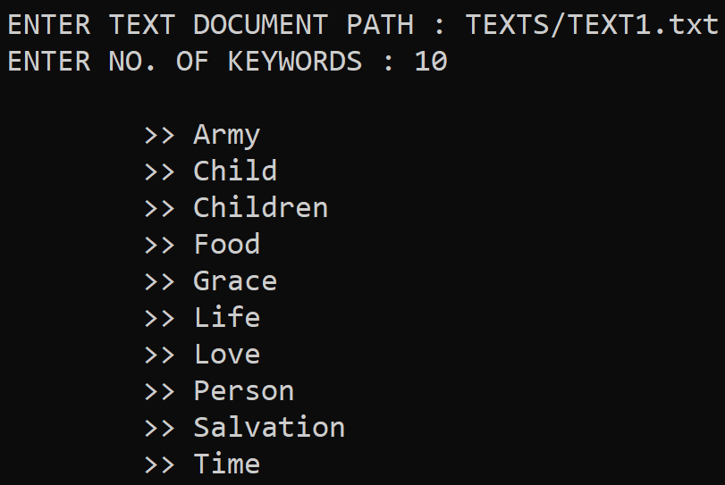 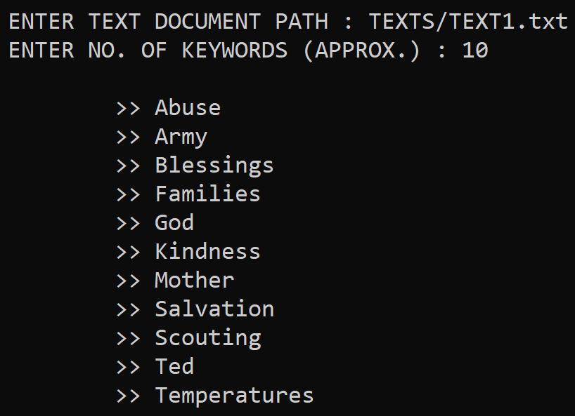 
&nbsp;&nbsp;&nbsp;&nbsp;&nbsp;&nbsp;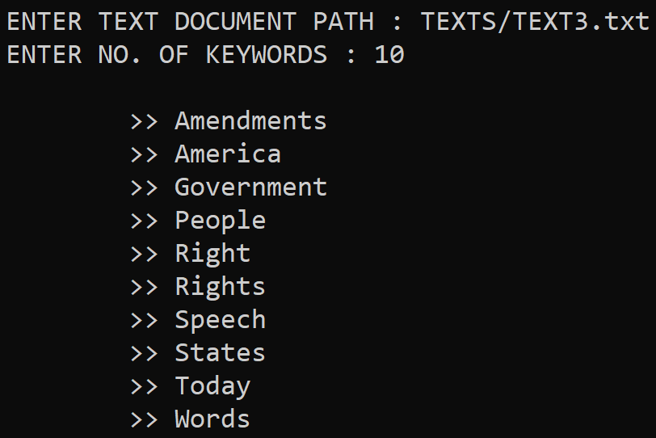 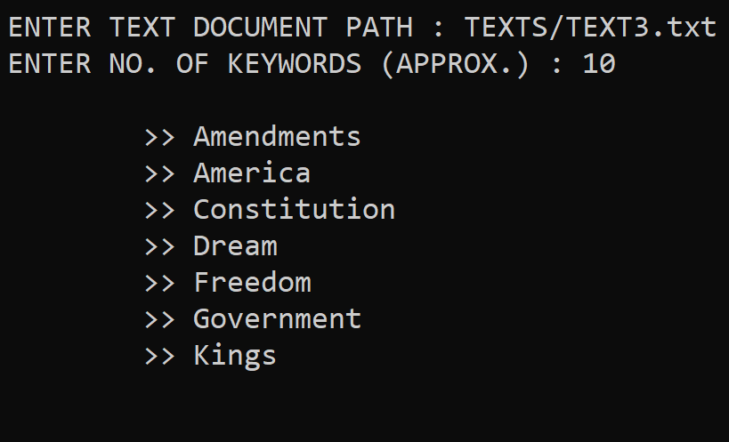 
&nbsp;&nbsp;&nbsp;&nbsp;&nbsp;&nbsp;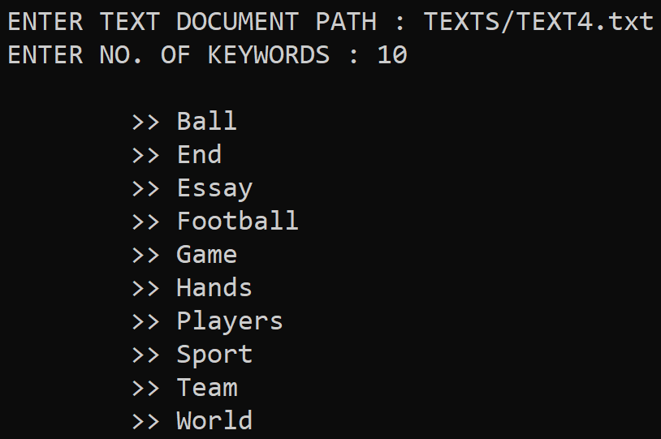 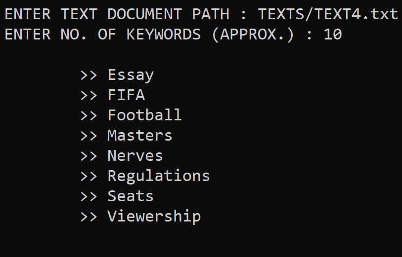 
&nbsp;&nbsp;&nbsp;&nbsp;&nbsp;&nbsp;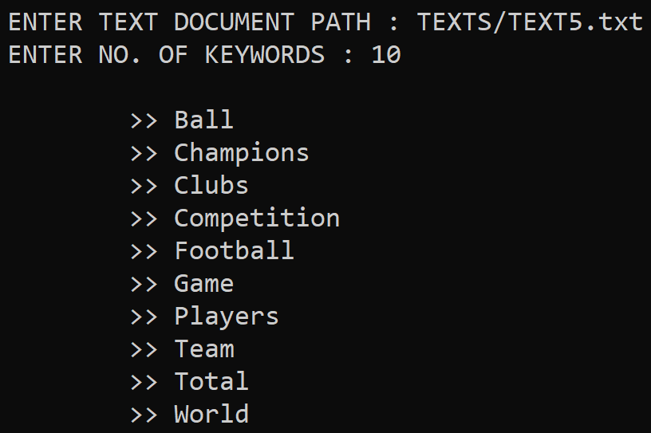 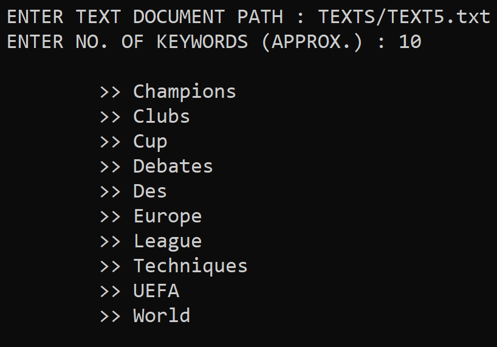 
&nbsp;&nbsp;&nbsp;&nbsp;&nbsp;&nbsp;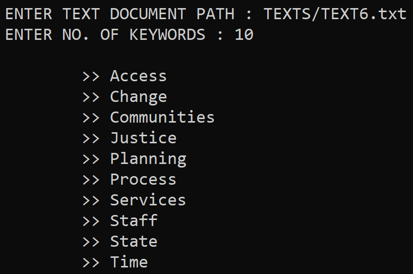 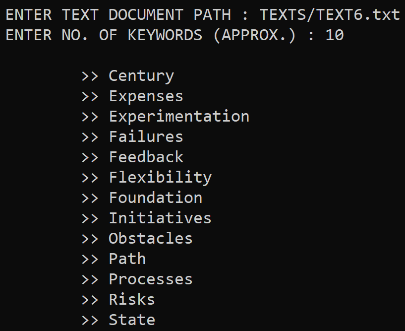 
&nbsp;&nbsp;&nbsp;&nbsp;&nbsp;&nbsp;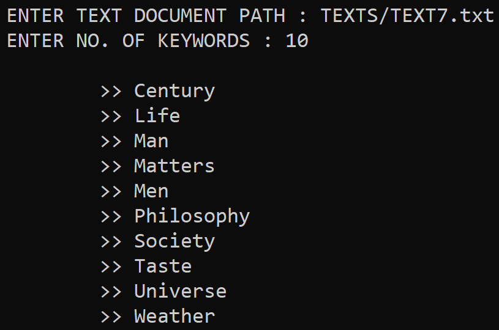 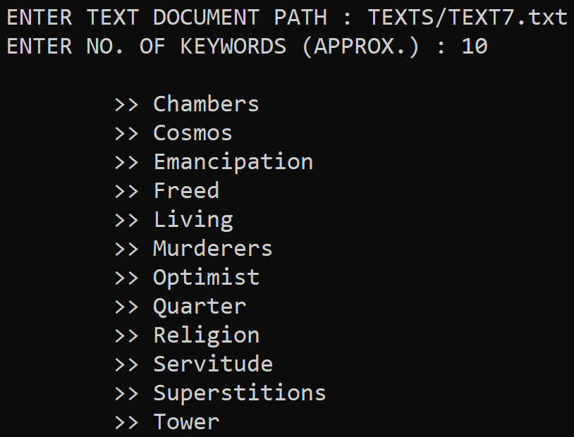 
  
The word-embeddings method performs undoubtedly better. Note that here the number of keywords extracted might not exactly be the number entered as input, naturally as the result of the algorithm previously decribed.
  
## Improvements
None of the implementations deals with the phrases and collocations. For example in the results for the document *TEXTS/TEXT5.txt* given by *KEYWORDS_EXTRACTION_WE.py*, *World* and *Cup* are stated as two distinct keywords, whereas instead the collocation *World Cup* should have been treated as one keyword. Many techniques can be used to identify phrases in a text, like a data driven approach in which the phrases are formed using unigram and bigram counts, using the following formula.

&nbsp;&nbsp;&nbsp;&nbsp;&nbsp;&nbsp;&nbsp;&nbsp;&nbsp;&nbsp;&nbsp;&nbsp;&nbsp;&nbsp;&nbsp;&nbsp;&nbsp;&nbsp;&nbsp;&nbsp;&nbsp;&nbsp;&nbsp;&nbsp;&nbsp;&nbsp;&nbsp;&nbsp;&nbsp;&nbsp;

The *δ* is used as a *discounting coefficient* and prevents too many phrases consisting of very infrequent words to be formed. The bigrams with score above the chosen threshold are then used as phrases. These phrases can hence be incorporated into the pre-existing algorithms to deal with phrases as keywords.
